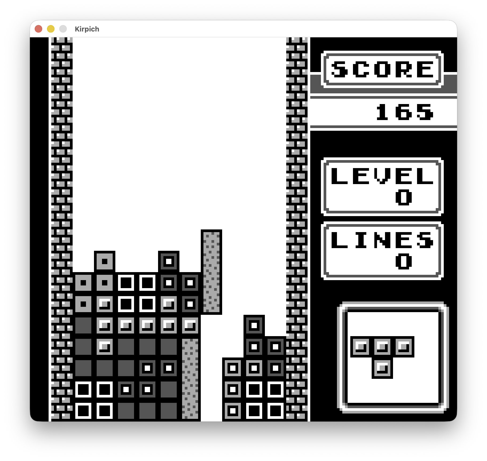
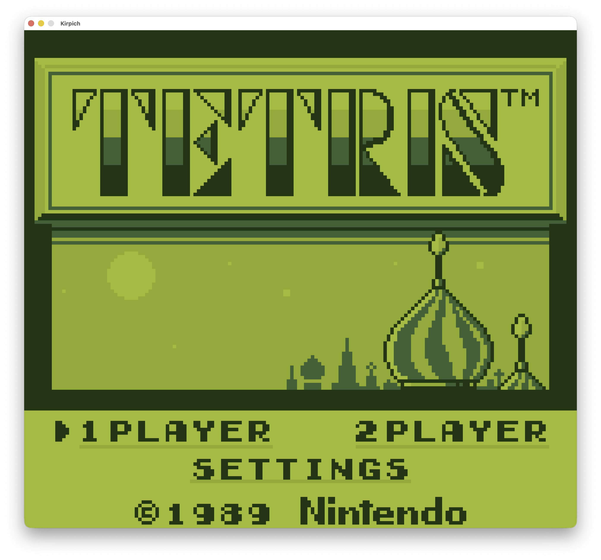
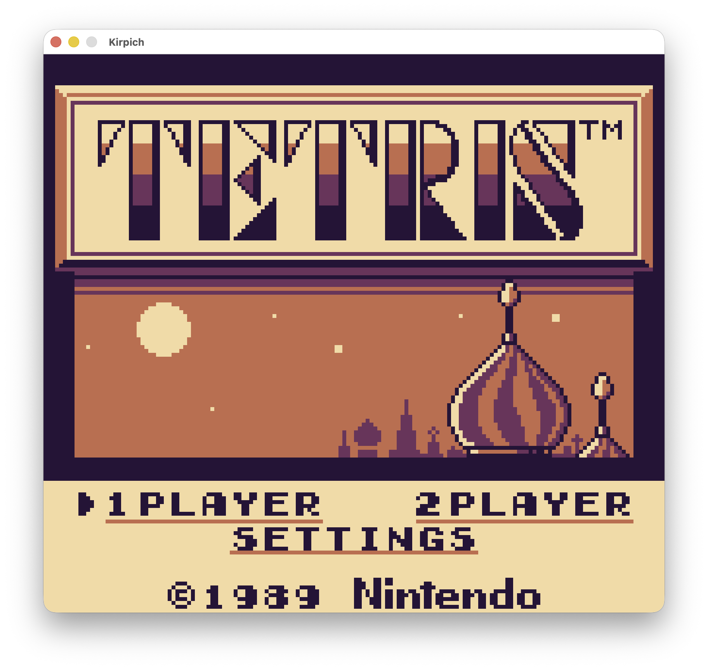
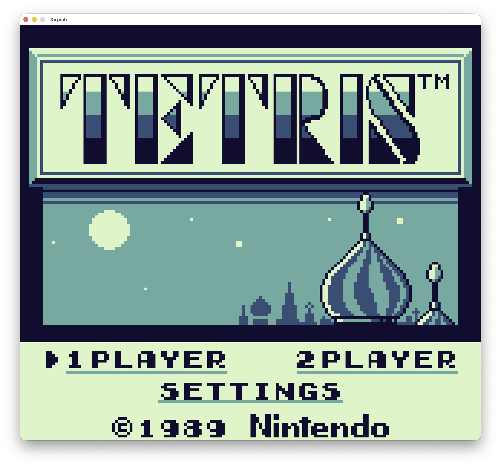
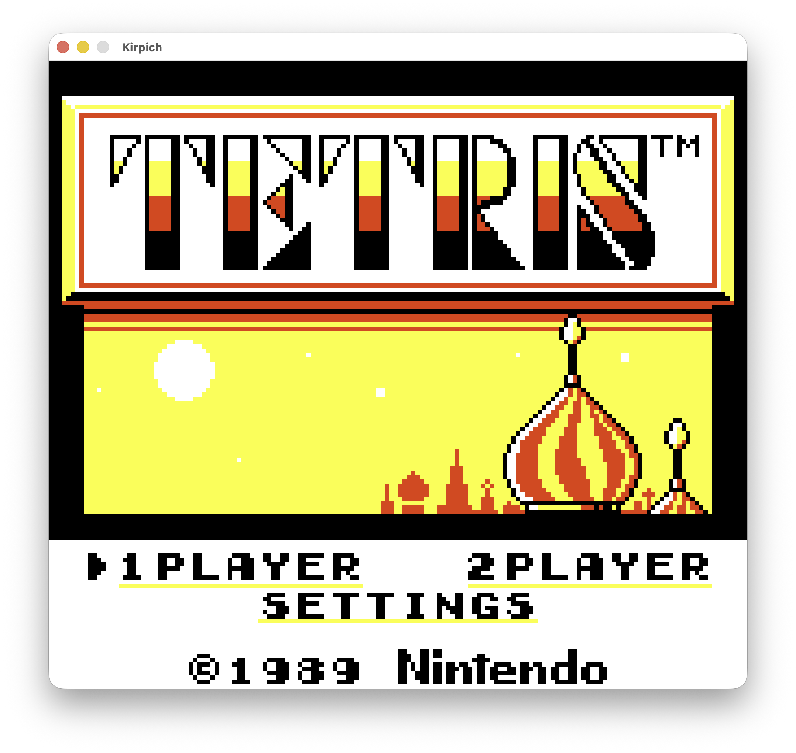
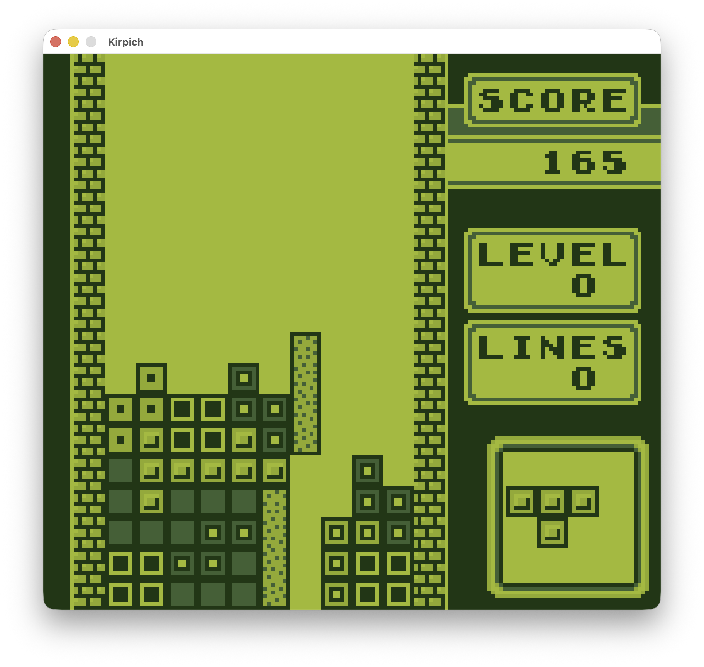
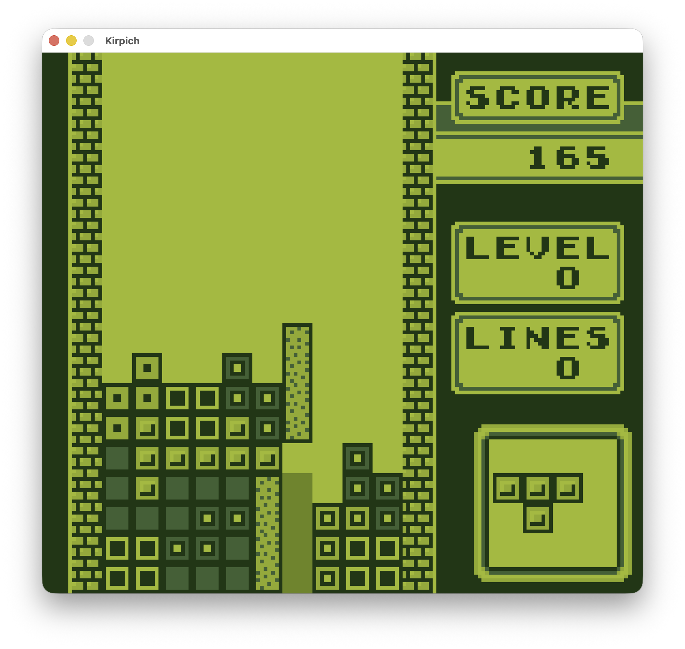

# Kirpich

<p align="center"></p>

A native reimplementation of **Tetris** for the Game Boy (DMG), running as ordinary desktop software on Windows, macOS, and Linux. Kirpich is built on the [Retro++ engine](https://github.com/RetroPlusPlus/Engine) and reproduces the original cartridge's observable behavior — the same game, given the same inputs — without emulating the hardware and without translating the assembly. The player's own cartridge supplies the graphics and the sound.

*Kirpich* (кирпич) is Russian for "brick".

## Features

- **The complete single-player game.** A-Type and B-Type, every menu and screen, pause, game over,
  the end-of-round scoreboard, and the ending performance a highest-difficulty B-Type win earns.
- **Both hidden endings.** Clearing B-Type from beneath five rows of garbage launches the Buran;
  reaching 100,000 points in A-Type launches a rocket, one of three sized by the final score.
- **A third game type.** C-Type is a marathon played over a rising floor. A count of drops sits on the
  panel: every drop takes one off it, every line cleared puts one back, and when it reaches zero the
  whole stack shifts up a row and a fresh line of garbage arrives underneath. One line per drop is
  breaking even. It has its own screen, its own starting level, and its own table of high scores, and
  it sits behind a settings switch that is off by default — a new player meets the cartridge's own two
  modes first.
- **The original audio.** The cartridge's sound driver runs unmodified on the engine's emulated
  audio unit. Music and sound effects are produced by the original code, not recreated.
- **Thirty-two color palettes**, selectable in-game with a live preview — the hardware greyscale,
  the original handheld's green, and thirty others, including the eight color schemes Windows 3.1
  shipped in its Control Panel.
- **An optional ghost piece** showing where the falling piece will land. Disabled by default, so
  the game plays exactly as the cartridge does until the player opts in.
- **Persistent high scores.** A qualifying round is ranked, named on the original letter-wheel
  entry screen, and kept across launches — the cartridge lost its tables at power-off.
- **Attract mode.** Left idle, the title screen plays the cartridge's two recorded demonstration
  rounds, alternating between them.
- **Preserved behavior throughout**, including the original's quirks: the reset chord
  (Start + Select + B + A) keeps the high-score tables and clears everything else, a multi-line
  clear duplicates its top row, and the unused stereo panning data remains unused. These are
  reproduced deliberately rather than corrected; see [`docs/DESIGN.md`](docs/DESIGN.md).
- **A settings screen** for fullscreen (Alt+Enter / Cmd+Enter also toggles it), window scaling, the
  palette selection, the ghost piece, the extra game types, and a confirmed high-score reset. Settings
  persist alongside the score tables and apply before the window opens.

<p align="center">
  
  
  
  
</p>
<p align="center"><em>Four of the thirty-two palettes: the original green, sunset, aurora, and Windows 3.1's Hot Dog Stand.</em></p>

<p align="center">
  
  
</p>
<p align="center"><em>The same frame with the ghost piece off and on.</em></p>

## Download

Binaries for all five targets are on the [latest release](https://github.com/etroimcasso/Kirpich/releases/latest):

| Platform | Artifact |
|---|---|
| macOS (Apple Silicon) | `Kirpich-macOS-arm64.dmg` — signed and notarized |
| Windows x64 / ARM64 | `Kirpich-windows-{x64,arm64}.zip` |
| Linux x64 / ARM64 | `Kirpich-linux-{x64,arm64}.zip` |

On first launch, Kirpich asks for a Tetris ROM and extracts the graphics and sound from it. That is
the entire setup; subsequent launches start directly.

### Where your files live

Everything Kirpich keeps for you — high scores, settings, the extracted assets, and the log — lives
in one per-user directory, independent of where the application itself sits:

| Platform | Location |
|---|---|
| macOS | `~/Library/Application Support/Kirpich/Kirpich/` |
| Windows | `%APPDATA%\Kirpich\Kirpich\` |
| Linux | `$XDG_DATA_HOME/Kirpich/Kirpich/` (typically `~/.local/share/Kirpich/Kirpich/`) |

Moving or updating the application leaves your scores and settings in place. Deleting this directory
returns Kirpich to a first launch: the ROM prompt reappears and the high-score tables start empty.

## Content and licensing posture

Kirpich distributes no playable copyrighted content: no ROM data, no extracted assets, nothing in
any build artifact. The graphics and sound-driver bytes are extracted locally from a Tetris
(World, Rev 1) ROM the player legitimately owns, into the player's own user directory, where they
remain. `.gitignore` bans ROM extensions and extracted content tree-wide, and the packaging step
verifies the shipped artifact carries neither. The screenshots above depict the game running
against the author's own cartridge and are included for identification. See
[`docs/features/asset-acquisition.md`](docs/features/asset-acquisition.md).

## Roadmap

- **Two-player** — the link-cable protocol and its screens, pending the engine's network substrate.
- **DMG display shader** — the original LCD's optical character: greenish tint, ghosting, dot grid.

---

## Architecture

The game logic is ordinary C++: the cartridge's data tables are `constexpr` arrays verified against
the ROM, its RAM layouts are structs, its code paths are functions. Nothing simulates the Game Boy's
PPU, memory mapper, or interrupt hardware.

Two subsystems are exceptions, and only these two run original machine code on an emulated CPU
inside the engine:

- **Piece randomization.** The original routine folds the DMG's divider register, which ticks
  independently of the program counter; the piece sequence depends on cycle-exact timing and cannot
  be reproduced by re-implementing the arithmetic.
- **Audio.** The ROM's sound driver programs the audio hardware on a cycle-driven cadence;
  faithful chiptune output requires running that driver against an emulated audio unit.

### Built on Retro++

Kirpich is a complete consumer of the [Retro++ engine](https://github.com/RetroPlusPlus/Engine) and
exercises most of its surface:

| Engine capability | How Kirpich uses it |
|---|---|
| Declarative rendering — tile and sprite layers, per-frame submission, shape-confined regions | The two screen buffers, the object layer, the settings screen's drawn overlays, and the ghost piece's silhouette regions |
| Palette system — indexed atlases, uploaded palettes | All thirty-two color ramps resident at once; switching palettes selects between uploaded handles |
| Sprite geometry queries | The ghost piece derives its shape from the falling piece's own placed sprites |
| Emulated SM83 virtual machine, surgical routine hosting | The piece randomizer and the procedural garbage fill — B-Type's starting rows and C-Type's rising floor — sharing one machine so the round init's piece draws advance the divider its garbage fill then reads |
| Hosted audio driver on an emulated audio unit | The cartridge's sound driver, running at its original addresses |
| Action-mapped input | Keyboard and gamepad bindings over the game's own press-edge and auto-repeat logic |
| Versioned save store with schema migration | Settings and high-score persistence, each at its own schema version and migrated forward across releases |
| Per-user file store | Extracted assets live beside the save data, independent of where the binary sits |
| Run loop at a configurable timing profile | The DMG's 59.7275 Hz simulation rate, decoupled from display refresh |
| Cross-platform windowing and packaging | One codebase shipping on five platform targets |

### Repository layout

| Path | What it is |
|---|---|
| `src/`, `include/kirpich/` | Port source and public headers |
| `tests/` | GoogleTest suite |
| `engine/` | [Retro++](https://github.com/RetroPlusPlus/Engine) engine submodule — brings SDL3 and SameBoy with it |
| `assets/gfx/default/`, `assets/audio/default/` | Where a development build reads its extracted assets; contents are generated locally and never committed. A player's extraction goes to the per-user data directory beside their save, not here |
| `docs/` | Design context and feature documentation |
| `tools/` | Development tooling |

The [kaspermeerts/tetris](https://github.com/kaspermeerts/tetris) disassembly is the derivation
reference. It is read during development as a sibling checkout outside this repository — it is not a
submodule, and the build never depends on it.

### Building

Requires CMake 3.28+, a C++20 compiler (GCC 13+ / Clang 16+ / AppleClang 15+ / MSVC 19.38+), and
recursive submodules — `engine/` brings SDL3 and SameBoy with it, and a plain clone without
`--recursive` leaves it empty (the build fails at configure time saying so):

```sh
git clone --recursive https://github.com/etroimcasso/Kirpich.git
cd Kirpich
cmake -S . -B build
cmake --build build --parallel
ctest --test-dir build
```

The build defaults to a lean Release configuration.

## License

Kirpich is licensed under the [GNU Affero General Public License v3.0](LICENSE), matching the
Retro++ engine's open-source license (the engine itself is dual-licensed AGPL-3.0 / commercial).
The upstream disassembly is published without a license.

Tetris is a trademark of Tetris Holding, LLC. This project is unaffiliated with and unendorsed by
the trademark holder, distributes no copyrighted content, and requires the user's own ROM.
